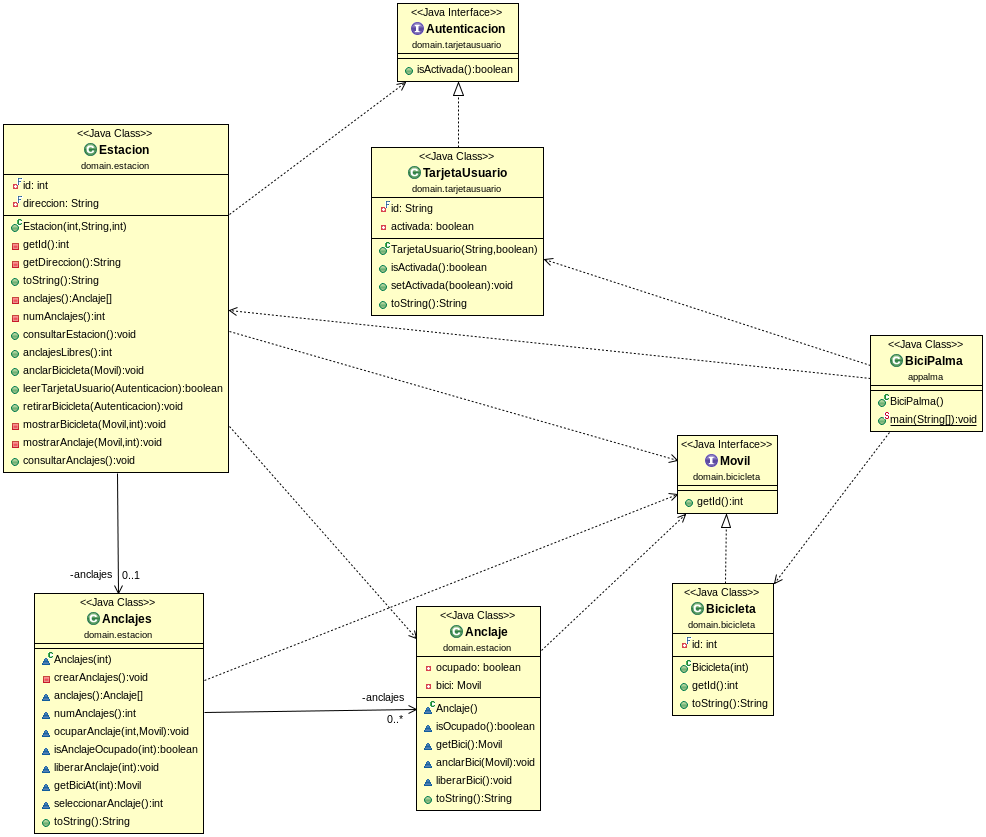

# Bicipalma
Basado en [Bicipalma de dfleta](https://github.com/dfleta/bicipalma), programado durante 1º Desarrollo de Aplicaciones Multiplataforma. 

## Diagrama
El programa sigue la arquitectura del siguiente diagrama UML dejando de lado la implementación de *interfaces* y realizando pequeños cambios a los argumentos pedidos por dos métodos (mencionados más abajo):

### Métodos modificados

`mostrarAnclajes` y `mostrarBicicleta` en ***edu.estatuas.domain.estacion.Estacion***:
- En vez de lanzar la posición en el array a través del print gracias a un argumento tipo Int, he tomado el objeto que debía de ser localizado en el array y he conseguido su posición a través de `(Arrays.asList(anclajes.anclajes()).indexOf(anclajeObservado))`. El resultado debería de ser el mismo. 